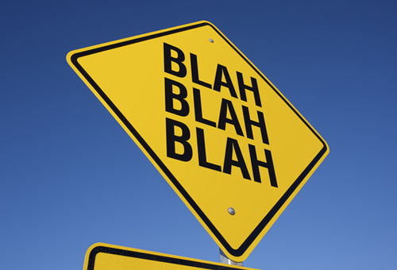

# bootstrap-photo-gallery

A jQuery plugin that will automatically create a Photo Gallery based on an unordered list of images. Supports image captions, modal, with "next" and "previous" paging. Plugin requires Bootstrap and jQuery.

### Current version Bootstrap 4

If you want an older version of the plugin (uses Bootstrap 3), download this [**branch**](https://github.com/michaelsoriano/bootstrap-photo-gallery/tree/v1) 

[**View Demo**](http://demo.michaelsoriano.com/bootstrap-gallery/master/demo.html)


### How to Use:

Make sure you include the required files before the plugin.

You need to create an unordered list of your images.

```
<ul>
   <li>
       
       <p>Optional text. This will also show in the modal</p>
   </li>
   <li>
       
   </li>
   <li>
       
   </li>
   ...
</ul>

```

Then initialize the plugin. 

```
$('ul.first').bsPhotoGallery();
```

You can pass the different options such as BS classes for different sizes

```
opts = {
   "classes" : "col-lg-2 col-md-4 col-sm-3 col-xs-12",
    "hasModal" : false
}
$('ul.first').bsPhotoGallery(opts);
```

The following options are available: 

<table class="table table-bordered table-striped responsive-utilities" style="margin-top:25px; margin-bottom:30px;">
<thead>
<tr>
<th>Option</th>
<th>Type</th>
<th>Description</th>
<th class="hidden-xs">Default Value</th>
</tr>
</thead>
<tbody>
<tr>
<th><code>classes</code></th>
<td class="is-visible">string</td>
<td>Bootstrap Grid classes</td>
<td class="is-hidden hidden-xs">col-xl-2 col-lg-2 col-md-2 col-sm-4</td>
</tr>
<tr>
<th><code>hasModal</code></th>
<td class="is-hidden">bool</td>
<td>show larger image in a modal when clicked</td>
<td class="is-visible hidden-xs">true</td>
</tr>
<tr>
<th><code>showControl</code></th>
<td class="is-hidden">bool</td>
<td>show next / previous buttons in modal</td>
<td class="is-hidden hidden-xs">true</td>
</tr> 
<th><code>shortText</code></th>
<td class="is-hidden">bool</td>
<td>truncate text to a single line in grid</td>
<td class="is-hidden hidden-xs">true</td>
</tr> 
</tbody>
</table>

### Change Log:

<strong>Update 6/26/2019:</strong> Removed gulp and dependencies due to security alerts.

<strong>Update 1/6/2018:</strong> Support for Bootstrap 4 has been added. BS4 has made several changes and removed plenty of old functionality - so the plugin had to be updated. 

1) Removed Glyphicons. Embedded svg code for the icons for the modal controls

2) Images in the gallery are now using background images - with fixed height. Background images with "cover" positioning is better than using images + resizing = especially for mobile

3) Added a new option "shortText". This is for the caption to be truncated to a single line if set to true. 

4) Moved demo styles to plugin. This just makes sense. If you need to update - update the CSS file. 

5) Removed fullHeight option 

6) Made classes more unique to the plugin

<strong>Update 6/24/2016: </strong> Several enhancements have been made to the plugin. See the following list for the most recent changes:

1) The Modal box that opens is always going to be the large modal. Images will scale up to 100% to fill the entire modal box. You still have the option of having a small thumbnail and linking to a different image for the large size - mainly for performance purposes.

2) A new plugin option called "fullHeight" that allows you to have different heights in the thumbnails inside the grid. Most people want to see uniform heights, so I default this value to "true". If you want to see dynamic heights, simply set this to "false". Note that this doesn't affect the modal images.

3) I've separated the styles into it's own stylesheet. You now have to include this stylesheet in your document, or you can simply copy the contents into your own stylesheet. I tried making everything inline so you only have to include the JS file, but it's been growing and having an external CSS is the only way to manage.

4) Added glyphicons for the "Next" and "Previous" links in the modal. This just looks better.

5) Images are required to have an alt tag, so I'm outputting the value of this into the modal as the title.

6) You can have additional text underneath the grid thumbnails by having a "p" tag with a class of "text". I grab this value and put it in the modal as well.

<strong>Update 12/13/2015: </strong> I've updated the plugin to support linking to a different image when shown in the modal box. Continue reading below for instructions.

<strong>Update 11/14/2015: </strong>This code for this tutorial have been converted into a jQuery plugin. This means that it's now easier to create a responsive photo gallery. The original tutorial is still available below (where is says "Original Tutorial"). Note that you don't need to follow it if you're using the plugin. But it's good to know the inner workings of Bootstrap regardless.


The original (and outdated) tutorial can be found here:

"How to create a responsive photo gallery using Bootstrap" :
http://michaelsoriano.com/create-a-responsive-photo-gallery-with-bootstrap-framework/

and

"Let’s Add Next and Previous Buttons to our Bootstrap Photo Gallery"
http://michaelsoriano.com/next-and-previous-buttons-bootstrap-photo-gallery/
